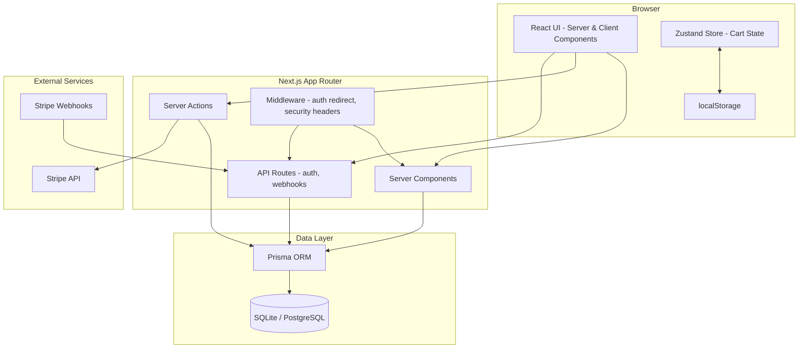
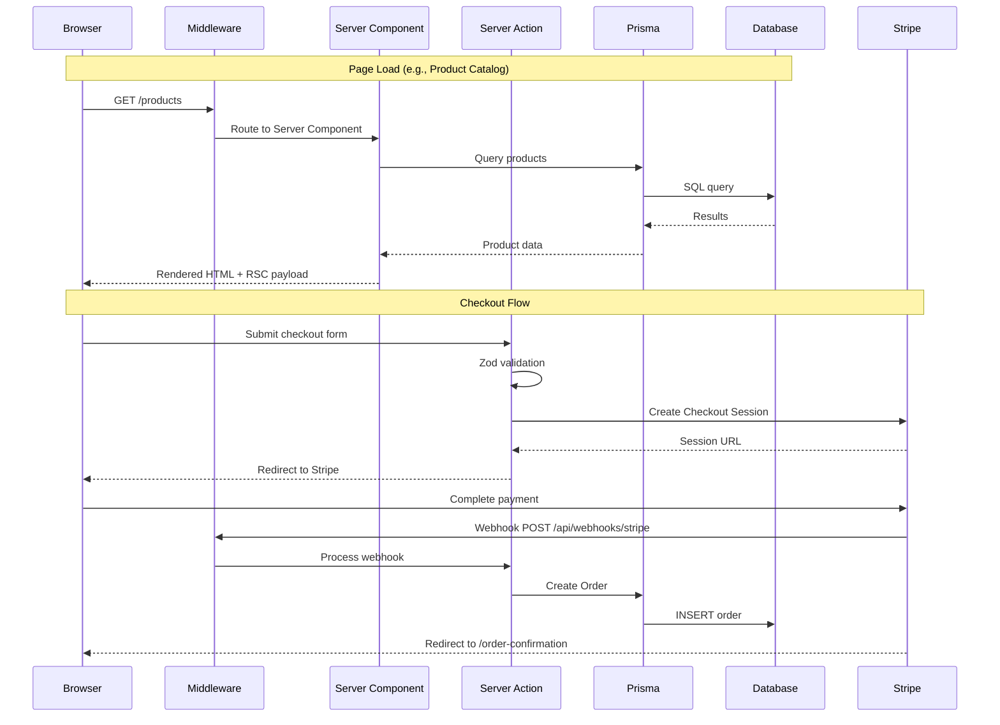
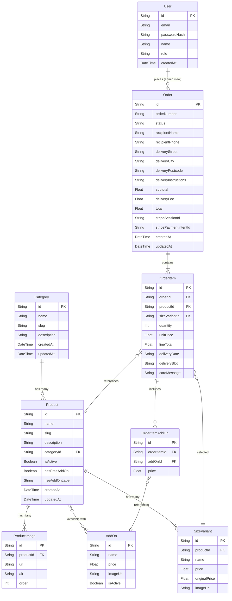

# Design Document — Raisa Wajs Florist

## Overview

Raisa Wajs Florist is a full-stack e-commerce application built with Next.js 14+ (App Router) for a florist business. The system provides a customer-facing storefront with product browsing, cart management, Stripe checkout, and delivery scheduling, alongside a protected admin panel for product/order/category CRUD operations.

The application follows a server-first architecture leveraging Next.js Server Components for data fetching and Server Actions for mutations. Client interactivity is handled through targeted Client Components, with Zustand managing cart state persisted to localStorage. Prisma ORM provides the data access layer over SQLite (development) or PostgreSQL (production), and NextAuth.js secures the admin panel with JWT-based sessions.

### Key Design Decisions

1. **Server Components by default** — All pages render as Server Components for SEO and performance. Client Components are used only where interactivity is required (carousels, cart, forms, accordions).
2. **Server Actions for mutations** — All data mutations (checkout, admin CRUD, contact form) use Next.js Server Actions with Zod validation, avoiding the need for separate API route handlers where possible.
3. **Zustand with localStorage persistence** — Cart state lives client-side to avoid server round-trips for cart operations. The `persist` middleware handles rehydration.
4. **Stripe Checkout Session flow** — Payment uses Stripe's server-side Checkout Session creation followed by client-side redirect, keeping PCI compliance simple.
5. **Prisma with SQLite/PostgreSQL** — SQLite for zero-config local development, PostgreSQL for production. Prisma abstracts the difference.

## Architecture

### High-Level Architecture Diagram



### Request Flow



### Directory Structure

```
raisa-wajs-florist/
├── prisma/
│   ├── schema.prisma
│   ├── seed.ts
│   └── migrations/
├── public/
│   └── images/
├── src/
│   ├── app/
│   │   ├── layout.tsx              # Root layout (Announcement Bar, Nav, Footer)
│   │   ├── page.tsx                # Homepage
│   │   ├── products/
│   │   │   ├── page.tsx            # Product Catalog
│   │   │   └── [slug]/page.tsx     # Product Detail
│   │   ├── cart/page.tsx
│   │   ├── checkout/page.tsx
│   │   ├── order-confirmation/[id]/page.tsx
│   │   ├── about/page.tsx
│   │   ├── contact/page.tsx
│   │   ├── admin/
│   │   │   ├── layout.tsx          # Admin layout with auth guard
│   │   │   ├── page.tsx            # Dashboard
│   │   │   ├── login/page.tsx
│   │   │   ├── products/
│   │   │   │   ├── page.tsx        # Product list
│   │   │   │   ├── new/page.tsx    # Create product
│   │   │   │   └── [id]/edit/page.tsx
│   │   │   ├── orders/
│   │   │   │   ├── page.tsx        # Order list
│   │   │   │   └── [id]/page.tsx   # Order detail
│   │   │   └── categories/
│   │   │       ├── page.tsx
│   │   │       └── new/page.tsx
│   │   └── api/
│   │       ├── auth/[...nextauth]/route.ts
│   │       └── webhooks/stripe/route.ts
│   ├── components/
│   │   ├── layout/
│   │   │   ├── AnnouncementBar.tsx
│   │   │   ├── Navbar.tsx
│   │   │   ├── Footer.tsx
│   │   │   └── MobileMenu.tsx
│   │   ├── home/
│   │   │   ├── HeroBanner.tsx
│   │   │   ├── ProductCarousel.tsx
│   │   │   ├── CategoryQuickLinks.tsx
│   │   │   ├── TrustBadges.tsx
│   │   │   ├── DeliveryPassPromo.tsx
│   │   │   ├── NewsletterSignup.tsx
│   │   │   ├── SeoContent.tsx
│   │   │   └── FaqAccordion.tsx
│   │   ├── product/
│   │   │   ├── ProductCard.tsx
│   │   │   ├── ProductGrid.tsx
│   │   │   ├── ProductFilters.tsx
│   │   │   ├── ProductSort.tsx
│   │   │   ├── ProductSearch.tsx
│   │   │   ├── ImageGallery.tsx
│   │   │   ├── SizeVariantSelector.tsx
│   │   │   ├── AddOnSelector.tsx
│   │   │   ├── DeliveryDatePicker.tsx
│   │   │   ├── CardMessageInput.tsx
│   │   │   └── Pagination.tsx
│   │   ├── cart/
│   │   │   ├── CartItemList.tsx
│   │   │   ├── CartItem.tsx
│   │   │   └── CartSummary.tsx
│   │   ├── checkout/
│   │   │   ├── CheckoutForm.tsx
│   │   │   ├── DeliveryForm.tsx
│   │   │   └── OrderSummary.tsx
│   │   └── ui/
│   │       ├── Toast.tsx
│   │       ├── ToastProvider.tsx
│   │       ├── Button.tsx
│   │       └── Input.tsx
│   ├── lib/
│   │   ├── prisma.ts               # Prisma client singleton
│   │   ├── auth.ts                  # NextAuth config
│   │   ├── stripe.ts               # Stripe client
│   │   └── utils.ts                # Shared utilities (formatPrice, cn, etc.)
│   ├── actions/
│   │   ├── checkout.ts
│   │   ├── contact.ts
│   │   ├── admin/
│   │   │   ├── products.ts
│   │   │   ├── orders.ts
│   │   │   └── categories.ts
│   │   └── newsletter.ts
│   ├── store/
│   │   └── cart.ts                  # Zustand cart store
│   ├── schemas/
│   │   ├── checkout.ts              # Zod schemas for checkout
│   │   ├── contact.ts
│   │   ├── product.ts
│   │   └── category.ts
│   ├── types/
│   │   └── index.ts                 # Shared TypeScript types
│   └── middleware.ts                # Auth redirect + security headers
├── __tests__/
│   ├── components/
│   ├── actions/
│   ├── store/
│   └── properties/                  # Property-based tests
├── next.config.js
├── tailwind.config.ts
├── vitest.config.ts
├── package.json
└── .env.example
```

## Components and Interfaces

### Layout Components

**AnnouncementBar** (Server Component)
- Renders a fixed top bar with promotional text, delivery cutoff, and freshness guarantee
- Props: none (content is static or fetched server-side)

**Navbar** (Client Component)
- Renders site logo, navigation links, search icon, and cart icon with item count badge
- Uses Zustand store to read cart item count
- Collapses to hamburger menu on mobile via `MobileMenu`
- Props: none (reads cart count from store)

**Footer** (Server Component)
- Multi-column layout: company info, Information links, Occasions links, social media icons, payment method icons
- Props: none

### Homepage Components

**HeroBanner** (Server Component)
- Full-width seasonal banner with headline, subheadline, price indicator, CTA button
- Props: `{ headline: string, subheadline: string, price: string, ctaText: string, ctaHref: string, imageUrl: string }`

**ProductCarousel** (Client Component)
- Horizontally scrollable container of `ProductCard` components
- Smooth scroll with left/right navigation arrows
- Props: `{ title: string, products: ProductWithVariants[] }`

**ProductCard** (Server Component, rendered within Client carousel)
- Displays product image, uppercase name, "from £X" price, optional save badge, optional free add-on badge, delivery availability text
- Links to `/products/[slug]`
- Props: `{ product: ProductWithVariants }`

**CategoryQuickLinks** (Server Component)
- Horizontal row of category buttons
- Props: `{ categories: { name: string, slug: string }[] }`

**TrustBadges** (Server Component)
- Four trust indicators in a grid
- Props: none (static content)

**DeliveryPassPromo** (Server Component)
- Promotional section for delivery subscription
- Props: none

**NewsletterSignup** (Client Component)
- Email input + submit button, calls Server Action
- Props: none

**FaqAccordion** (Client Component)
- Collapsible Q&A items with keyboard accessibility (Enter/Space to toggle)
- Props: `{ items: { question: string, answer: string }[] }`

### Product Components

**ProductGrid** (Server Component)
- Responsive grid: 1 col mobile, 2 col tablet, 3 col desktop
- Props: `{ products: ProductWithVariants[] }`

**ProductFilters** (Client Component)
- Filter controls for occasion, flower type, price range
- Updates URL search params (no full page reload via `useRouter`)
- Props: `{ categories: Category[], currentFilters: FilterState }`

**ProductSort** (Client Component)
- Dropdown: price low-high, price high-low, name A-Z, newest
- Props: `{ currentSort: string }`

**ProductSearch** (Client Component)
- Text input with debounced search, updates URL params
- Props: `{ currentQuery: string }`

**Pagination** (Client Component)
- Page number buttons + prev/next, updates URL params
- Props: `{ currentPage: number, totalPages: number }`

**ImageGallery** (Client Component)
- Large primary image + clickable thumbnails
- Props: `{ images: string[] }`

**SizeVariantSelector** (Client Component)
- Three radio-style buttons for Standard/Deluxe/Premium
- Props: `{ variants: SizeVariant[], selected: string, onSelect: (id: string) => void }`

**AddOnSelector** (Client Component)
- Checkbox list of add-on products with prices
- Props: `{ addOns: AddOn[], selected: string[], onToggle: (id: string) => void }`

**DeliveryDatePicker** (Client Component)
- Calendar-style date picker for next 14 days
- Props: `{ selectedDate: string | null, onSelect: (date: string) => void }`

**CardMessageInput** (Client Component)
- Textarea with 200-char limit and live counter
- Props: `{ value: string, onChange: (value: string) => void }`

### Cart Components

**CartItemList** (Client Component)
- Renders list of `CartItem` components from Zustand store
- Shows empty state with link to catalog when cart is empty

**CartItem** (Client Component)
- Displays product name, variant, add-ons, delivery slot, card message, quantity controls, line total
- Props: `{ item: CartItemType, onUpdateQuantity: (qty: number) => void, onRemove: () => void }`

**CartSummary** (Client Component)
- Subtotal, delivery fee, order total, "Proceed to Checkout" button
- Reads from Zustand store

### Checkout Components

**CheckoutForm** (Client Component)
- Orchestrates delivery form + order summary + Stripe payment
- Calls Server Action for checkout session creation

**DeliveryForm** (Client Component)
- Recipient name, phone, address fields with Zod validation and inline errors
- Props: `{ onSubmit: (data: DeliveryData) => void }`

**OrderSummary** (Server Component)
- Read-only summary of cart items, add-ons, delivery fee, total

### UI Components

**Toast / ToastProvider** (Client Component)
- Context-based toast system, top-right positioned, auto-dismiss 5s, manual close, vertical stacking
- Exposes `useToast()` hook returning `{ success(msg), error(msg) }`

### Server Actions Interface

| Action | File | Input | Output |
|--------|------|-------|--------|
| `createCheckoutSession` | `actions/checkout.ts` | `CheckoutInput` (Zod validated) | `{ url: string }` redirect to Stripe |
| `submitContactForm` | `actions/contact.ts` | `ContactInput` (Zod validated) | `{ success: boolean }` |
| `subscribeNewsletter` | `actions/newsletter.ts` | `{ email: string }` | `{ success: boolean }` |
| `createProduct` | `actions/admin/products.ts` | `ProductInput` (Zod validated) | `{ product: Product }` |
| `updateProduct` | `actions/admin/products.ts` | `ProductUpdateInput` | `{ product: Product }` |
| `deleteProduct` | `actions/admin/products.ts` | `{ id: string }` | `{ success: boolean }` |
| `updateOrderStatus` | `actions/admin/orders.ts` | `{ id: string, status: OrderStatus }` | `{ order: Order }` |
| `createCategory` | `actions/admin/categories.ts` | `CategoryInput` | `{ category: Category }` |
| `updateCategory` | `actions/admin/categories.ts` | `CategoryUpdateInput` | `{ category: Category }` |
| `deleteCategory` | `actions/admin/categories.ts` | `{ id: string }` | `{ success: boolean, error?: string }` |

### API Routes

| Route | Method | Purpose |
|-------|--------|---------|
| `/api/auth/[...nextauth]` | GET/POST | NextAuth.js authentication endpoints |
| `/api/webhooks/stripe` | POST | Stripe webhook handler (payment confirmation) |

## Data Models

### Entity Relationship Diagram



### Prisma Schema (Key Models)

```prisma
model Category {
  id          String    @id @default(cuid())
  name        String
  slug        String    @unique
  description String?
  products    Product[]
  createdAt   DateTime  @default(now())
  updatedAt   DateTime  @updatedAt
}

model Product {
  id            String         @id @default(cuid())
  name          String
  slug          String         @unique
  description   String
  categoryId    String
  category      Category       @relation(fields: [categoryId], references: [id])
  isActive      Boolean        @default(true)
  hasFreeAddOn  Boolean        @default(false)
  freeAddOnLabel String?
  images        ProductImage[]
  sizeVariants  SizeVariant[]
  orderItems    OrderItem[]
  createdAt     DateTime       @default(now())
  updatedAt     DateTime       @updatedAt
}

model ProductImage {
  id        String  @id @default(cuid())
  productId String
  product   Product @relation(fields: [productId], references: [id], onDelete: Cascade)
  url       String
  alt       String
  order     Int     @default(0)
}

model SizeVariant {
  id            String      @id @default(cuid())
  productId     String
  product       Product     @relation(fields: [productId], references: [id], onDelete: Cascade)
  name          String      // "Standard", "Deluxe", "Premium"
  price         Float
  originalPrice Float?      // For sale items
  imageUrl      String?     // Variant-specific image
  orderItems    OrderItem[]
}

model AddOn {
  id              String           @id @default(cuid())
  name            String
  price           Float
  imageUrl        String?
  isActive        Boolean          @default(true)
  orderItemAddOns OrderItemAddOn[]
}

model Order {
  id                     String      @id @default(cuid())
  orderNumber            String      @unique
  status                 String      @default("pending") // pending, confirmed, out_for_delivery, delivered, cancelled
  recipientName          String
  recipientPhone         String
  deliveryStreet         String
  deliveryCity           String
  deliveryPostcode       String
  deliveryInstructions   String?
  subtotal               Float
  deliveryFee            Float
  total                  Float
  stripeSessionId        String?     @unique
  stripePaymentIntentId  String?
  items                  OrderItem[]
  createdAt              DateTime    @default(now())
  updatedAt              DateTime    @updatedAt
}

model OrderItem {
  id            String           @id @default(cuid())
  orderId       String
  order         Order            @relation(fields: [orderId], references: [id], onDelete: Cascade)
  productId     String
  product       Product          @relation(fields: [productId], references: [id])
  sizeVariantId String
  sizeVariant   SizeVariant      @relation(fields: [sizeVariantId], references: [id])
  quantity      Int
  unitPrice     Float
  lineTotal     Float
  deliveryDate  String
  deliverySlot  String
  cardMessage   String?
  addOns        OrderItemAddOn[]
}

model OrderItemAddOn {
  id          String    @id @default(cuid())
  orderItemId String
  orderItem   OrderItem @relation(fields: [orderItemId], references: [id], onDelete: Cascade)
  addOnId     String
  addOn       AddOn     @relation(fields: [addOnId], references: [id])
  price       Float
}

model User {
  id           String   @id @default(cuid())
  email        String   @unique
  passwordHash String
  name         String
  role         String   @default("admin")
  createdAt    DateTime @default(now())
}
```

### Zustand Cart Store Shape

```typescript
interface CartItem {
  id: string;                    // Unique cart item ID (generated client-side)
  productId: string;
  productName: string;
  productSlug: string;
  productImage: string;
  sizeVariantId: string;
  sizeVariantName: string;
  unitPrice: number;
  quantity: number;
  addOns: {
    id: string;
    name: string;
    price: number;
  }[];
  deliveryDate: string | null;
  deliverySlot: string | null;
  cardMessage: string | null;
}

interface CartStore {
  items: CartItem[];
  addItem: (item: Omit<CartItem, 'id'>) => void;
  removeItem: (id: string) => void;
  updateQuantity: (id: string, quantity: number) => void;
  clearCart: () => void;
  
  // Computed
  itemCount: () => number;
  subtotal: () => number;
  deliveryFee: () => number;
  total: () => number;
}
```

### Zod Validation Schemas

```typescript
// Checkout schema
const checkoutSchema = z.object({
  recipientName: z.string().min(1, "Recipient name is required").max(100),
  recipientPhone: z.string().min(10, "Valid phone number required").max(15),
  deliveryStreet: z.string().min(1, "Street address is required").max(200),
  deliveryCity: z.string().min(1, "City is required").max(100),
  deliveryPostcode: z.string().min(5, "Valid postcode required").max(10),
  deliveryInstructions: z.string().max(500).optional(),
});

// Contact form schema
const contactSchema = z.object({
  name: z.string().min(1, "Name is required").max(100),
  email: z.string().email("Valid email required"),
  phone: z.string().max(15).optional(),
  subject: z.string().min(1, "Subject is required").max(200),
  message: z.string().min(10, "Message must be at least 10 characters").max(2000),
});

// Product admin schema
const productSchema = z.object({
  name: z.string().min(1).max(200),
  description: z.string().min(1).max(5000),
  categoryId: z.string().cuid(),
  images: z.array(z.object({
    url: z.string().url(),
    alt: z.string().min(1),
  })).min(1),
  sizeVariants: z.array(z.object({
    name: z.enum(["Standard", "Deluxe", "Premium"]),
    price: z.number().positive(),
    originalPrice: z.number().positive().optional(),
  })).min(3),
  hasFreeAddOn: z.boolean().optional(),
  freeAddOnLabel: z.string().optional(),
});

// Category admin schema
const categorySchema = z.object({
  name: z.string().min(1).max(100),
  description: z.string().max(500).optional(),
});
```

## Correctness Properties

*A property is a characteristic or behavior that should hold true across all valid executions of a system — essentially, a formal statement about what the system should do. Properties serve as the bridge between human-readable specifications and machine-verifiable correctness guarantees.*

### Property 1: ProductCard renders required information

*For any* product with at least one size variant, the rendered ProductCard should display the product name in uppercase, the price prefixed with "from £" (using the lowest variant price), and delivery availability text.

**Validates: Requirements 2.2, 2.6**

### Property 2: ProductCard sale and discount display

*For any* product where a size variant has an `originalPrice` greater than its `price`, the rendered ProductCard should display the original price with a strikethrough, the sale price as the current price, and a save badge showing the difference (e.g., "Save £15").

**Validates: Requirements 2.3, 2.4**

### Property 3: ProductCard free add-on badge

*For any* product where `hasFreeAddOn` is true, the rendered ProductCard should display a badge containing the `freeAddOnLabel` text.

**Validates: Requirements 2.5**

### Property 4: ProductCard links to correct detail page

*For any* product with a slug, clicking the ProductCard should navigate to `/products/{slug}`.

**Validates: Requirements 2.7**

### Property 5: Product catalog filtering

*For any* set of products and any applied filter criteria (occasion, flower type, price range), every product in the filtered result should match all active filter criteria, and no product matching the criteria should be excluded.

**Validates: Requirements 3.3**

### Property 6: Product catalog sorting

*For any* list of products and any selected sort option (price low-high, price high-low, name A-Z, newest), the resulting list should be correctly ordered according to the selected sort criterion.

**Validates: Requirements 3.4**

### Property 7: Product catalog search

*For any* search query string and set of products, every product in the search results should have a name or description that contains the search text (case-insensitive), and no matching product should be excluded.

**Validates: Requirements 3.5**

### Property 8: Pagination page size

*For any* total number of products greater than zero, each page should contain at most 12 products, and the total number of pages should equal `Math.ceil(totalProducts / 12)`.

**Validates: Requirements 3.6**

### Property 9: Size variant selection updates price

*For any* product with multiple size variants, selecting a variant should update the displayed price to exactly match that variant's `price` value.

**Validates: Requirements 4.4**

### Property 10: Default size variant is Standard

*For any* product with size variants including "Standard", the Product Detail Page should have the "Standard" variant selected by default on initial load.

**Validates: Requirements 4.3**

### Property 11: Delivery date picker range

*For any* current date, the delivery date picker should offer selectable dates starting from tomorrow through 14 days from today, and no dates outside this range should be selectable.

**Validates: Requirements 4.5**

### Property 12: Card message character limit

*For any* input string, the CardMessageInput component should enforce a maximum of 200 characters, and the live character counter should display `200 - currentLength` remaining characters.

**Validates: Requirements 4.7**

### Property 13: Add item stores all selected options

*For any* product configuration (variant, add-ons, delivery date, card message), adding it to the cart should result in the cart containing an item with exactly those selected options preserved.

**Validates: Requirements 4.8, 18.3**

### Property 14: Cart total calculations

*For any* cart state with one or more items, each line item total should equal `unitPrice * quantity + sum(addOn prices) * quantity`, the subtotal should equal the sum of all line totals, and the order total should equal `subtotal + deliveryFee`.

**Validates: Requirements 5.3, 5.5**

### Property 15: Cart state round-trip persistence

*For any* cart state, serializing to localStorage via Zustand persist middleware and then rehydrating should produce a cart state equivalent to the original.

**Validates: Requirements 5.6, 18.2**

### Property 16: Cart mutations update state and derived values

*For any* cart with items: (a) updating an item's quantity should change that item's quantity and recalculate its line total and the cart subtotal/total, (b) removing an item should decrease the item count and recalculate totals, and (c) the `itemCount` computed value should always equal the sum of all item quantities.

**Validates: Requirements 18.4, 18.5, 18.6**

### Property 17: Cart item displays card message

*For any* cart item that has a non-null `cardMessage`, the rendered cart item should display that card message text.

**Validates: Requirements 5.8**

### Property 18: Checkout form Zod validation

*For any* checkout form input, if any required field is empty or fails its Zod validation rule, the form should prevent submission and display an inline error message on the first invalid field. For any input where all fields pass validation, no error messages should be displayed.

**Validates: Requirements 6.6, 6.9**

### Property 19: Checkout client-server validation parity

*For any* checkout form input, the client-side Zod schema validation result should be identical to the server-side Zod schema validation result (same fields accepted, same fields rejected with same error types).

**Validates: Requirements 16.2**

### Property 20: Order confirmation clears cart

*For any* cart state with items, when the Order Confirmation Page loads, the Zustand store should clear all cart items, resulting in an empty cart.

**Validates: Requirements 7.6**

### Property 21: Contact form validation

*For any* contact form input, if any required field (name, email, subject, message) is empty or invalid, the form should display inline error messages. For any valid input, no error messages should appear.

**Validates: Requirements 9.2**

### Property 22: Admin route authentication guard

*For any* admin panel route and any unauthenticated request, the middleware should redirect to the admin login page. No admin content should be accessible without a valid NextAuth session.

**Validates: Requirements 10.1, 10.2**

### Property 23: Admin login error message is generic

*For any* invalid credential combination (wrong email, wrong password, or both), the login error message should be identical ("Invalid email or password"), never revealing which specific field is incorrect.

**Validates: Requirements 10.5**

### Property 24: Admin product list displays required fields

*For any* product in the database, the admin product list should display its name, category name, base price (Standard variant price), and active/inactive status.

**Validates: Requirements 11.1**

### Property 25: Admin edit product form pre-population

*For any* existing product, the edit product form should be pre-populated with that product's current name, description, category, images, and size variant data.

**Validates: Requirements 11.4**

### Property 26: Admin order list displays required fields

*For any* order in the database, the admin order list should display its order number, customer name, order date, delivery date, total amount, and current status.

**Validates: Requirements 12.1**

### Property 27: Admin category list displays name and product count

*For any* category in the database, the admin category list should display its name and the correct count of associated products.

**Validates: Requirements 13.1**

### Property 28: Category deletion prevention with associated products

*For any* category that has one or more associated products, attempting to delete it should fail with a warning message, and the category should remain in the database.

**Validates: Requirements 13.5**

### Property 29: ARIA labels on interactive elements

*For any* interactive element in the homepage (carousel navigation controls, FAQ accordion toggle buttons, newsletter signup form inputs), the element should have an appropriate `aria-label` or `aria-labelledby` attribute.

**Validates: Requirements 14.5**

### Property 30: Product images use Next.js Image component

*For any* product or banner image rendered on the homepage, it should use the Next.js `Image` component with `width`, `height`, and `alt` attributes set.

**Validates: Requirements 15.1**

### Property 31: Pages include meta tags

*For any* page in the application, the rendered HTML should include `<title>`, `<meta name="description">`, and Open Graph meta tags (`og:title`, `og:description`).

**Validates: Requirements 15.2**

### Property 32: Product page JSON-LD structured data

*For any* product, the Product Detail Page should contain a valid JSON-LD script tag following the Schema.org Product schema, including the product name, description, price, and image.

**Validates: Requirements 15.3**

### Property 33: Referential integrity in database

*For any* foreign key relationship in the Prisma schema (Product→Category, SizeVariant→Product, OrderItem→Order, etc.), attempting to create a record with a non-existent foreign key should fail with a constraint violation error.

**Validates: Requirements 17.2**

### Property 34: Seed data size variants per product

*For any* product created by the seed script, it should have at least three size variant records (Standard, Deluxe, Premium) each with a distinct positive price.

**Validates: Requirements 17.4**

### Property 35: Zustand store manages complete cart item shape

*For any* item added to the cart, the stored item should contain all required fields: productId, productName, productSlug, productImage, sizeVariantId, sizeVariantName, unitPrice, quantity, addOns array, deliveryDate, deliverySlot, and cardMessage.

**Validates: Requirements 18.1**

### Property 36: Add-on display on Product Detail Page

*For any* set of active add-on products, the Product Detail Page should render each add-on with its name, price, and a selectable checkbox.

**Validates: Requirements 4.6**

## Error Handling

### Client-Side Errors

| Scenario | Handling |
|----------|----------|
| Form validation failure (checkout, contact, admin) | Inline error messages below invalid fields via Zod `.safeParse()`. First invalid field is focused. Form submission is prevented. |
| Add to cart with missing delivery date | Disable "Add to Cart" button until delivery date is selected. Show tooltip/hint. |
| Card message exceeds 200 characters | Input is capped at 200 chars via `maxLength`. Counter shows remaining. |
| Network error on Server Action call | Catch error in try/catch, display error toast with "Something went wrong. Please try again." |
| Stripe payment failure | Display error toast with Stripe's error message. Keep form state so user can retry. |
| Cart rehydration failure (corrupted localStorage) | Catch JSON parse error, reset cart to empty state, log warning to console. |

### Server-Side Errors

| Scenario | Handling |
|----------|----------|
| Zod validation failure in Server Action | Return `{ success: false, errors: zodErrors }` — never throw. Client displays inline errors. |
| Database query failure (Prisma) | Catch `PrismaClientKnownRequestError`, return appropriate error message. Log full error server-side. |
| Stripe API error | Catch Stripe errors, return user-friendly message. Log full error with Stripe error code. |
| Stripe webhook signature verification failure | Return 400 status immediately. Do not process the event. Log the attempt. |
| Unauthorized admin access | Middleware redirects to `/admin/login`. Server Actions check session and return 401 if missing. |
| Category deletion with products | Return `{ success: false, error: "Cannot delete category with associated products" }`. |
| Product not found (404) | Use Next.js `notFound()` function to render the 404 page. |
| Rate limit exceeded | Return 429 status with `Retry-After` header. Display "Too many requests" message. |

### Error Boundaries

- A root error boundary (`app/error.tsx`) catches unhandled errors and displays a generic error page with a "Try Again" button.
- A `app/not-found.tsx` page handles 404 routes with a link back to the homepage.
- Admin panel has its own error boundary (`app/admin/error.tsx`) with admin-specific messaging.

## Testing Strategy

### Testing Framework

- **Unit & Integration Tests**: Vitest + React Testing Library
- **Property-Based Tests**: `fast-check` library (via `@fast-check/vitest` integration)
- **Test Location**: `__tests__/` directory mirroring `src/` structure, with `__tests__/properties/` for property-based tests

### Unit Tests (Specific Examples & Edge Cases)

Unit tests focus on concrete scenarios, edge cases, and integration points:

- **Component rendering**: Verify homepage sections render expected content (Requirement 1 acceptance criteria)
- **Empty cart state**: Verify "Your cart is empty" message and catalog link (Req 5.4)
- **No search results**: Verify "No products found" message (Req 3.7)
- **Toast behavior**: Auto-dismiss after 5s (mocked timers), manual close button, stacking (Req 19)
- **Stripe webhook**: Reject unsigned webhooks (Req 16.3)
- **Admin login**: Valid credentials redirect, invalid show generic error (Req 10.3–10.6)
- **Order confirmation**: Renders order details correctly (Req 7.1–7.5)
- **Security headers**: Verify Next.js config sets required headers (Req 16.1)
- **Seed data**: Verify counts (15+ products, 6+ categories, 4+ add-ons, 1+ admin user) (Req 17.3, 17.5–17.7)
- **Accessibility**: Semantic HTML elements present, keyboard navigation works (Req 14.4, 14.6)

### Property-Based Tests (Universal Properties)

Each correctness property from the design document is implemented as a single property-based test using `fast-check`. Each test runs a minimum of 100 iterations.

Each test is tagged with a comment in the format:
**Feature: raisa-wajs-florist, Property {number}: {property title}**

Key property test groupings:

1. **ProductCard rendering** (Properties 1–4): Generate random products with varying prices, discounts, add-ons, and slugs. Verify rendering rules hold for all generated products.

2. **Catalog filtering, sorting, search, pagination** (Properties 5–8): Generate random product lists and filter/sort/search criteria. Verify result correctness.

3. **Product Detail Page** (Properties 9–12, 36): Generate random products with variants, random dates, random card message strings. Verify selection, date range, and character limit behaviors.

4. **Cart store operations** (Properties 13–17, 35): Generate random cart items with various options. Verify add/update/remove operations, total calculations, and state shape.

5. **Cart persistence round-trip** (Property 15): Generate random cart states, serialize to JSON (simulating localStorage), deserialize, and verify equivalence.

6. **Form validation** (Properties 18–19, 21): Generate random form inputs (valid and invalid). Verify Zod schemas accept/reject correctly and client/server produce identical results.

7. **Admin operations** (Properties 22–28): Generate random products/orders/categories. Verify list rendering, form pre-population, auth guards, and deletion constraints.

8. **SEO and accessibility** (Properties 29–32): Generate random products. Verify ARIA labels, Image component usage, meta tags, and JSON-LD output.

9. **Database integrity** (Properties 33–34): Generate random foreign key values. Verify constraint enforcement and seed data invariants.

### Test Configuration

```typescript
// vitest.config.ts
import { defineConfig } from 'vitest/config';
import react from '@vitejs/plugin-react';
import path from 'path';

export default defineConfig({
  plugins: [react()],
  test: {
    environment: 'jsdom',
    globals: true,
    setupFiles: ['./vitest.setup.ts'],
    include: ['__tests__/**/*.{test,spec}.{ts,tsx}'],
  },
  resolve: {
    alias: {
      '@': path.resolve(__dirname, './src'),
    },
  },
});
```

### Property Test Example Structure

```typescript
// __tests__/properties/cart-store.property.test.ts
import { test } from '@fast-check/vitest';
import * as fc from 'fast-check';

// Feature: raisa-wajs-florist, Property 14: Cart total calculations
test.prop([fc.array(cartItemArbitrary, { minLength: 1 })])(
  'cart totals equal sum of line totals plus delivery fee',
  (items) => {
    // ... test implementation
  }
);
```

### Test Coverage Goals

- Property-based tests: All 36 correctness properties covered
- Unit tests: All edge cases and example-based acceptance criteria
- Focus areas: Cart store logic, form validation schemas, product display logic, admin CRUD operations
